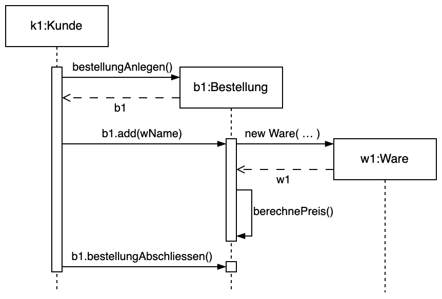

# Aufgabe 1 – Programmierparadigmen und Sprachen


## a) Ergänzen Sie das Organigramm sinnvoll
### b) Welche Programmiersprachen sollten erwähnt werden?
- **Funktionale Sprachen:** Haskell, LISP, Clojure, Elexir
- **Deklarative Sprachen:** SQL, XSLT, Prolog
- **Logische und KI-basierte Sprachen:** Prolog, Datalog, Mercury
### c) Definieren Sie die Begriffe „FunkP“ und „ImP“
- **Imperatives Programmieren (ImP):**
	- Ein Programmierparadigma, das den Rechner über eine Folge von Befehlen anweist, den Zustand zu verändern. Es basiert auf Anweisungen, Schleifen, Variablen und veränderbaren Zuständen. Typische Sprachen: C, Java, Python (imperative Nutzung).
- **Funktionales Programmieren (FunkP):**
	- Ein Paradigma, bei dem die Berechnung als Auswertung mathematischer Funktionen ohne veränderliche Zustände und Nebenwirkungen verstanden wird. Es setzt auf Rekursion, unveränderliche Datenstrukturen und häufig auf höherwertige Funktionen. Typische Sprachen: Haskell, Lisp, ML, Scala (in funktionalem Stil).
### d) Nennen Sie drei Unterschiede
| Aspekt              | Imperatives Programmieren                           | Funktionales Programmieren                                                           |
| ------------------- | --------------------------------------------------- | ------------------------------------------------------------------------------------ |
| Zustandsveränderung | Verwendet mutable Variablen und ändert den Zustand  | Vermeidet veränderbare Zustände (immutable Daten)                                    |
| Steuerung           | Nutzt Schleifen, Befehlssequenzen und Seiteneffekte | Nutzt Rekursion, Ausdrucks-Auswertung und rein funktionale Konzepte (pure functions) |
| Seiteneffekte       | Operationen haben oft Seiteneffekte                 | Funktionen sind meist “pure” (ohne Seiteneffekte)                                    |
# Aufgabe 2 – Imperative Programmierung in der Sprache C
### a) Lösen Sie quadratische Gleichung in der allg. Form:   $ax^2+bx+c=0$
- **Lösungsformel:** $x_{1,2} = \frac{-b \pm \sqrt{D}}{2a}$ mit $D = b^2 - 4ac$
- **Fallunterscheidung:**
	1. $D>0$:  $x_1 = \frac{-b + \sqrt{D}}{2a}$;  $x_1 = \frac{-b - \sqrt{D}}{2a}$
	2. $D=0$:  $x_1 = x_2 = - \frac{b}{2a}$
	3. $D \neq 0$: Funktion besitzt keine reellen Nullstellen
### b) Implementieren Sie die Aufgabe in der Sprache C unter dem imperativen Paradigma. 
```
#include <stdio.h>
#include <math.h>

int main(void) {
    double a, b, c, D, x1, x2;
    
    printf("Geben Sie a, b, c (durch Leerzeichen getrennt) ein: ");
    if (scanf("%lf %lf %lf", &a, &b, &c) != 3) {
        printf("Ungültige Eingabe.\n");
        return 1;
    }
    
    if (a == 0) {
        printf("Fehler: a darf nicht 0 sein (keine quadratische Gleichung).\n");
        return 1;
    }
    
    D = b * b - 4 * a * c;
    
    if (D > 0) {
        x1 = (-b + sqrt(D)) / (2 * a);
        x2 = (-b - sqrt(D)) / (2 * a);
        printf("Zwei reelle Nullstellen: x1 = %lf und x2 = %lf\n", x1, x2);
    } else if (D == 0) {
        x1 = -b / (2 * a);
        printf("Gleichung besitzt eine Doppelnullstelle: x = %lf\n", x1);
    } else {  // D < 0
        printf("Gleichung besitzt keine reellen Nullstellen.\n");
    }
    
    return 0;
}
```
# Aufgabe 3 – Syntax und Fehler in C++
- Finden Sie die syntaktischen und offensichtlichen semantischen Fehler/Warnings **(mind. 7 vorhanden)** im folgenden Programm und begründen Sie Ihre Entscheidung in Stichworten.
```
#include <hänge_mathe.h>       // Fehler 1: Kein existierender Header; vermutlich sollte hier <cmath> stehen.
#include “iostream”            // Fehler 2: Falsche Anführungszeichen (typographische statt ASCII); sollte #include <iostream> sein.
#include <stdlib.h>
using  namespace std_in_out;   // Fehler 3: Falscher Namespace; in C++ ist meist "std" gemeint.

#define PI = 3.14159265358979323846  // Fehler 4: Falsche Makro-Definition, das Gleichheitszeichen ist nicht zulässig. Richtig: #define PI 3.14159265358979323846

void main (void)  // Fehler 5: main muss als int main() deklariert werden.
{
    int r;
    double A, U, V;
    cout << "Bitte Radius eingeben: "; 	
    cin << r;             // Fehler 6: Falscher Operator für Eingabe; richtig: cin >> r;
    u = 2.*PI*r ;         // Fehler 7: Variable "u" wurde nicht deklariert (soll vermutlich U heißen); zudem: Multiplikation in C++ funktioniert, aber Variable-Ungleichheit muss korrigiert werden.
    A1 = PI*r*r ;         // Fehler 8: Variable "A1" existiert nicht (vielleicht sollte hier A stehen); außerdem wird fälschlicherweise eine neue Variable verwendet.
    V = (4./3.)*PI*r*r*r*r;  // Fehler 9: Falsche Formel für das Kugelvolumen: Es müsste r³ statt r⁴ heißen.
    cout <<  "Der Umfang dieses Kreises ist: " << u << endl;
    cout << "Der Flaecheninhalt ist:  << A << endl; // Fehler 10: Anführungszeichen und Einfügeoperatoren fehlen; richtig: cout << "Der Flaecheninhalt ist: " << A << endl;
    cout << "Eine Kugel mit demselben Radius hat ein Volumen von " <<  V << 	endl;
    system("PAUSIEREN");
    return 0;
}// ende main
```
### Aufgabe 4 – Rekursion und Funktionale Programmierung in Python
Implementieren Sie die Funktion _**ggT()**_ in Python. Berechnen Sie ggT für die Testdaten { (11,22), (37,118), (38,10) } mit dem Bezeichner **_Liste_**.
```
def ggt(a, b):
    # Basisfall: wenn beide Zahlen gleich sind, ist der ggT gefunden.
    if a == b:
        return a
    # Falls a kleiner als b, wird b reduziert.
    elif a < b:
        return ggt(a, b - a)
    # Falls a größer als b, wird a reduziert.
    else:
        return ggt(a - b, b)

# Testdaten als Liste von Tupeln:
test_data = [(11, 22), (37, 118), (38, 10)]

# Berechnung und Ausgabe der ggT-Werte:
for a, b in test_data:
    print(f"ggT({a}, {b}) = {ggt(a, b)}")
```
### Aufgabe 5 – Objektorientierung in C++
- Eliminieren Sie mehrere Fehler im Programm. Ergänzen Sie die Lücken.
- Instanziieren Sie ein weiteres Objekt B für die Klasse `ware` mit Fantasiedaten in der Funktion `main()`

#### Fehler im Programm:
1. `print`-Methode
	- Attribute `Titel`, `Bezeichnung`, `Firma`nicht existent
	- Korrekte `print`-Methode:
```
void ware::print() {
    cout << "GTIN-Barcode13 = " << GTIN 
         << ", Geraetedaten = " << Geraetedaten 
         << ", Hersteller = " << Hersteller 
         << ", Preis = " << Preis << endl;
}
```
2. Falsche Instanziierung von `Preis` → `preis = …` → Groß-/Kleinschreibung beachten!
3. Fehlendes schließendes Anführungszeichen und Semikolon (und `endl`) in der Konstruktor-Ausgabe: `cout << "Neue Ware im Lager wurde angelegt`
	- **Korrekt:** `cout << "Neue Ware im Lager wurde angelegt" << endl;`
4. Falsches Dezimaltrennzeichen im Konstruktoraufruf in `main()` → `2299,0`
	- **Korrekt:**
```
ware A("1234567891234", 
       "ASUS Vivobook Pro 16X OLED (K6604) 16 Zoll 64 GB Win 11 Pro, CPU i9 HX, GPU NVIDIA® GeForce RTX 4070 2 TB SSD", 
       "Cyberport DD", 2299.00);
```
5. Falscher Objektname beim Methodenaufruf in `main()`
	- Objekt a wird angelegt → `ware A( ... )`→ `X.print()` wird statt `A.print()` aufgerufen
6. Plattformabhängiger Aufruf `system("PAUSE")` → nur unter Windows existent
#### Korrektes Programm mit Kopierkonstruktor
```
#include <iostream>
#include <cstring>
using namespace std;

class ware {
	private:
	    char GTIN[14];         // 13 Ziffern + '\0'
	    char Geraetedaten[301]; // 300 Zeichen + '\0'
	    char Hersteller[181];   // 180 Zeichen + '\0'
	    float Preis;
	public:
	    // Konstruktor
	    ware(const char* code, const char* geraetedaten, const char* hersteller, float preis);
    
	    // Kopierkonstruktor
	    ware(const ware &w);
	    
	    // Methode zur Setzung der GTIN
	    void SetzeGTIN(const char* code);
	    
	    // Methode zur Ausgabe der Ware
	    void print() const;
};

void ware::SetzeGTIN(const char* code) {
    // Sichert, dass maximal 13 Zeichen kopiert werden und schließt mit '\0'
    strncpy(GTIN, code, 13);
    GTIN[13] = '\0';
}

ware::ware(const char* code, const char* geraetedaten, const char* hersteller, float preis)
    : Preis(preis)
{
    SetzeGTIN(code);
    strncpy(Geraetedaten, geraetedaten, 300);
    Geraetedaten[300] = '\0';
    strncpy(Hersteller, hersteller, 180);
    Hersteller[180] = '\0';
    cout << "Neue Ware im Lager wurde angelegt." << endl;
}

ware::ware(const ware &w) {
    // Kopieren aller Daten
    strncpy(GTIN, w.GTIN, 14);
    strncpy(Geraetedaten, w.Geraetedaten, 301);
    strncpy(Hersteller, w.Hersteller, 181);
    Preis = w.Preis;
    cout << "Ware wurde kopiert." << endl;
}

void ware::print() const {
    cout << "GTIN-Barcode13: " << GTIN << endl;
    cout << "Bezeichnung: " << Geraetedaten << endl;
    cout << "Hersteller: " << Hersteller << endl;
    cout << "Preis: " << Preis << " Euro" << endl;
}

int main() {
    cout << "WARE" << endl;
    
    // Instanziierung des Objekts A mit den gegebenen Daten
    ware A("1234567891234",
           "ASUS Vivobook Pro 16X OLED (K6604) 16 Zoll 64 GB Win 11 Pro, CPU i9 HX, GPU NVIDIA® GeForce RTX 4070 2 TB SSD",
           "Cyberport DD",
           2299.00f);
    A.print();
    
    // Instanziierung eines weiteren Objekts B mit Fantasiedaten
    ware B("9876543210987",
           "Fantasie Laptop Modell X - 15 Zoll, 32 GB RAM, 1 TB SSD, Intel i7",
           "Fantasie Hersteller",
           1599.99f);
    B.print();
    
    // Demonstration des Kopierkonstruktors:
    ware C = A;
    C.print();
    
    return 0;
}
```
# Aufgabe 6 – Objektorientierte Modellierung mit UML
### a) Erklären Sie den Unterschied zwischen Klasse und Objekt. Was ist Kapselung? Geben Sie Definition der Vererbung an.
-  **Unterschied zwischen Klasse und Objekt:**
	- **Klasse:** Ein Bauplan bzw. eine Vorlage, die Attribute (Daten) und Methoden (Funktionen) definiert.
	-  **Objekt:** Eine Instanz einer Klasse, d. h. ein konkretes Exemplar, das gemäß dem Bauplan erstellt wurde.
- **Kapselung:**
	- Das Prinzip, Daten (Attribute) und Funktionen (Methoden), die auf diese Daten zugreifen, in einer Einheit (Klasse) zu bündeln. Zugriffe werden über definierte Schnittstellen geregelt, sodass interne Details verborgen bleiben.
- **Vererbung:**
	- Ein Mechanismus, bei dem eine Klasse (Subklasse) Eigenschaften und Methoden einer anderen Klasse (Basisklasse) übernimmt und erweitern oder spezialisieren kann.
### b) Führen Sie ein Beispiel für die Beziehungen zwischen den Klassen an.
- Allg. Beziehungen → **Assoziation:** Klassen kommunizieren miteinander (z. B. ein Kunde bestellt Ware).
### c) Welche Arten spezieller Beziehungen kennen Sie?
- Spezielle Beziehungen → Beziehungen, welche über grundl. Assoziation hinausgehen:
	- **Aggregation:** Eine Klasse besteht aus mehreren Objekten einer anderen Klasse (z. B. ein Warenkorb enthält mehrere Waren).
	- **Komposition:** Eine stärkere Form der Aggregation, bei der die Bestandteile ohne das Ganze nicht existieren können (z. B. ein Auto und sein Motor).
	- **Abhängigkeit:** Eine Klasse nutzt die Dienste einer anderen Klasse (z.B. ein Bestellservice nutzt eine Zahlungsart, um eine Zahlung durchzuführen).
	- **Generalisation:** Vererbungsbeziehungen, bei denen allgemeinere Klassen von spezifischeren Klassen abgeleitet werden (z.B. Auto erbt von Fahrzeug → d.h., Auto ist eine spezialisierte Form von Fahrzeug). 
	- **Realisation:** Bei Schnittstellen (Interfaces) wird die Implementierung durch konkrete Klassen realisiert (z.B. Kreditkarte implementiert das Interface Zahlungsart → d. h., es muss dessen Methoden definieren).
### d) Modellieren Sie den Sachverhalt aus der Aufgabe 5 mit einem UML-Klassendiagramm. Erweitern Sie den Sachverhalt um die Klassen Bestellung und Kunde.

### e) Welche Beziehungen und weitere Diagramme sind dabei erforderlich?
7. Kunde gibt Bestellung auf → Assoziation
8. Bestellung besteht aus verschiedenen Waren → Aggregation
	- Keine Komposition, da Waren auch unabhängig von Bestellungen existieren können
### f) Erarbeiten Sie den Zeitablauf als Sequenzdiagramm, wobei der Kunde die Ware über die Bestellung kauft.

# Aufgabe 7 – SWT und KI
### a) Welche Rolle spielen SWT-Vorgehensmodelle? Welches Ziel verfolgt ein Vorgehensmodell?
- **Rolle:**
	- Vorgehensmodelle in der Softwareentwicklung (SWT) strukturieren den Entwicklungsprozess in klar definierte Phasen, erleichtern die Planung, Kontrolle und Kommunikation im Projekt und sorgen für Qualitätsmanagement.
- **Ziel:**
	- Das Hauptziel ist es, Software systematisch, termingerecht und kosteneffizient unter Einhaltung der Qualitätsstandards zu entwickeln. Durch das frühzeitige Erkennen von Fehlern und strukturierte Testphasen werden teure Nachbesserungen vermieden.
### b) Warum spart man Kosten dabei und vermeidet Entwicklungshelfer?
- **Kosteneinsparungen:**
	- Durch strukturierte Prozesse (Planung, Design, Test) werden spätere Fehler gefunden, die sonst in der Wartung und im Support hohe Kosten verursachen würden.
-  **Vermeidung von Entwicklungshelfern:**
	- Klare Prozesse reduzieren den Bedarf an „Notlösungen“ und improvisierten Ansätzen, die oft zusätzliche Ressourcen und externe Hilfe erfordern.
### c) Beschreiben Sie das einfache Wasserfall-Modell in Stichworten.
- Lineare Abfolge: Anforderungsanalyse → Design → Implementierung → Test → Wartung
- Keine Rückkopplungsschleifen (sehr wenig Iteration)
- Statische Planung, schwerfällig bei Änderungen
### d) Beschreiben Sie das V-Modell
- Entwicklungsphasen und Testphasen verlaufen parallel (linke Seite: Spezifikation, rechte Seite: Verifikation)
- Strenge Dokumentation und formale Abnahme
- Hohe Qualitätssicherung durch frühzeitige Testplanung
### e) Beschreiben Sie das agile Scrum-Modell
- Iterative und inkrementelle Entwicklung in Sprints
- Selbstorganisierte Teams, tägliche Stand-ups
- Flexibilität und regelmäßiges Feedback
- Kontinuierliche Integration und häufige Releases
### f) Welche Rolle spielen in der SWT die Repositorien wie bspw. GitHub?
- **Versionskontrolle:** Repositorien ermöglichen die Nachverfolgung von Änderungen, Versionsmanagement und parallele Entwicklung (Branches).
- **Kollaboration:** Erleichtern Zusammenarbeit, Code-Reviews und Continuous Integration.
- **Dokumentation:** Bieten Tools für Issue-Tracking, Wikis und automatische Testpipelines, die die Codequalität unterstützen.
### g) Warum setzt man in der Zukunft immer mehr KI für SWT-Zwecke ein?
- **Automatisierung:** KI kann Code-Analyse, Testfallgenerierung, Bug-Erkennung und Refactoring unterstützen.
- **Effizienzsteigerung:** Automatische Code-Vervollständigung und -Optimierung sparen Zeit.
- **Verbesserung der Qualität:** Durch maschinelles Lernen können häufige Fehlerquellen erkannt und vermieden werden.
# Aufgabe 8 – XML und deklarative Programmierung
### a) Was sind Markup-Tags?
- Markup Tags sind spezielle Zeichenfolgen in einem Dokument, die zur Kennzeichnung und Strukturierung von Inhalten dienen. Sie werden meist in spitzen Klammern geschrieben (z. B. `<tag> … </tag>`).
### b) Welche Informationen enthält eine DTD?
- Eine DTD definiert die zulässige Struktur, Elemente, Attribute und deren Beziehungen in einem XML-Dokument. Sie gibt an, welche Elemente vorkommen dürfen, in welcher Reihenfolge und mit welchen Attributen.
### c) Welchen Vorteil bringt die Trennung von Inhalt und Layout?
- **Wartbarkeit:** Inhalte können unabhängig vom Design geändert werden
- **Wiederverwendbarkeit:** Derselbe Inhalt kann in unterschiedlichen Layouts dargestellt werden
- **Flexibilität:** Designer und Entwickler können parallel arbeiten, da Layout und Inhalt getrennt gepflegt werden.
### d) Wie verwendet man MathML für die Darstellung mathematischer Formeln?
- Beispiel – Darstellung eines Bruchs:
```
<math xmlns="http://www.w3.org/1998/Math/MathML">
  <mfrac>
    <mi>a</mi>
    <mi>b</mi>
  </mfrac>
</math>
```